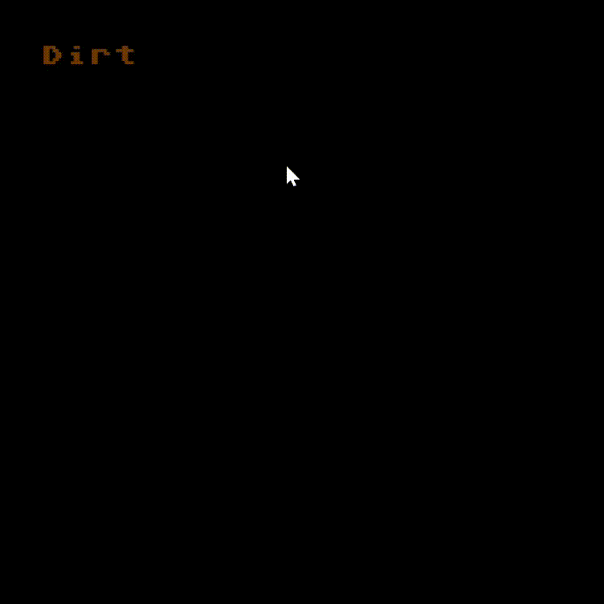
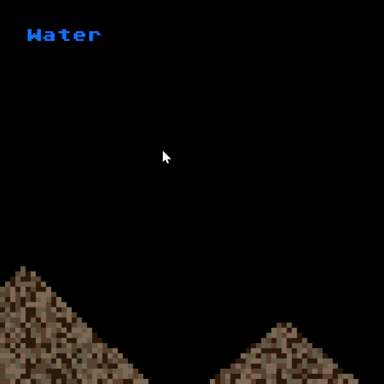
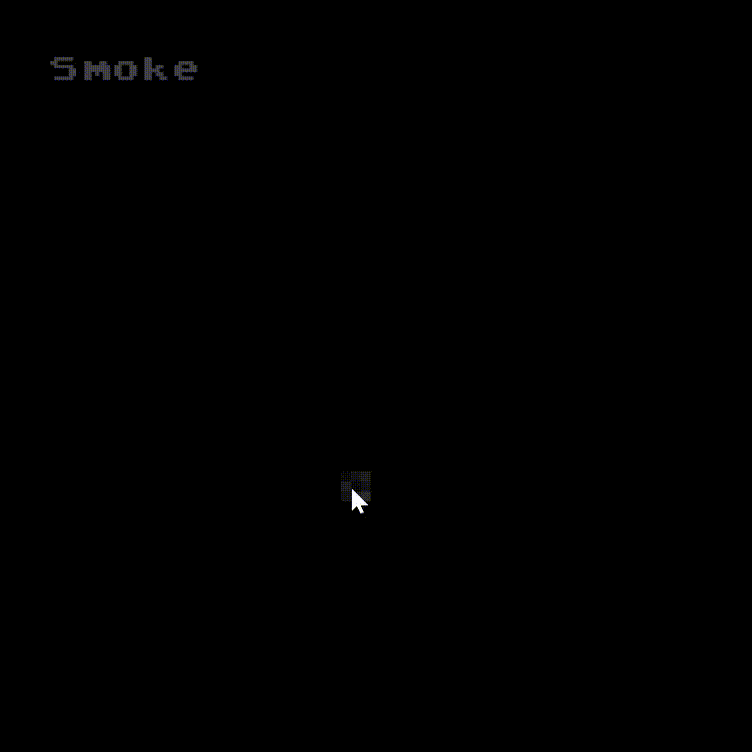
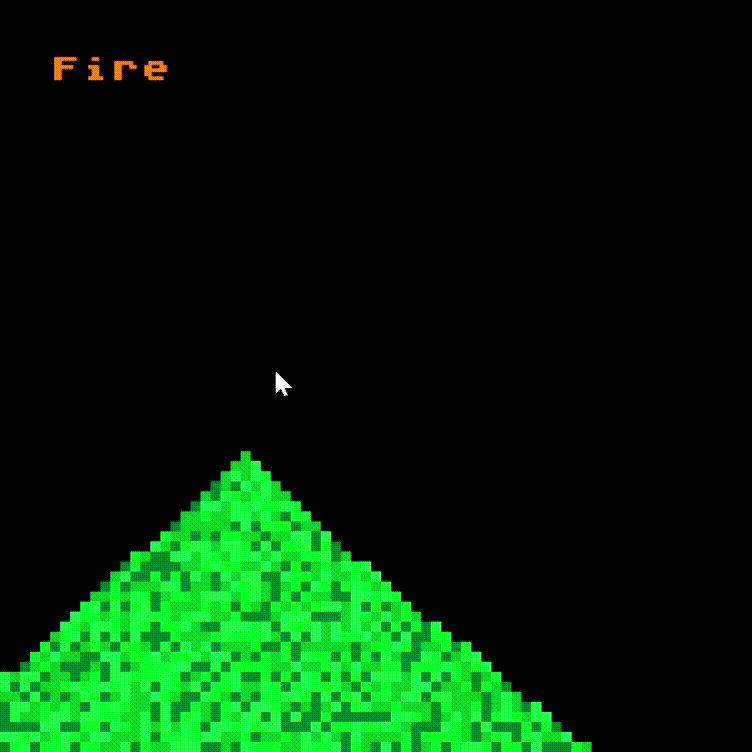

# A falling-sand game
I got bored. 

Boredom led to the creation of this glorious game.

This is a simple 2D particle falling-sand game built using C++ & SFML. This is not a complete project but it has a working framework, including:
- an approximation of gravity for solids, liquids and gases
- A working neighbor-checking system for adjacent grid squares
- Basic cellular automata logic
## Screenshot
  
## Features
### Currently implemented elements:
- $${\color{brown}Dirt}$$ (you can also see both the narrow and wide mouse placement modes)  
   
- $${\color{blue}Water}$$ 
   
- $${\color{grey}Smoke}$$ 
   
- $${\color{green}Gunpowder}$$ (gunpowder is green because I ran out of colours)
- $${\color{orange}Fire}$$ 
   
### Other features:
- Custom SFML font using Atari 800–inspired typography
- Custom window icon loaded directly from resources
- 75x75 grid-based simulation
- Object-oriented particle system
## Downloading & Running
1. Go to the Releases section
2. Download the most recent `.exe`
3. Run it
That’s it.
## Controls
- `Left-Click`: Place pixels
- Hold `Left-Shift`: Increase placement radius
- `Space`: Cycle through pixel types
## How It Works
Genuine sorcery and pure nonsense.

There is a 75×75 grid of squares. When the left mouse button is pressed, a pixel object is created and placed into the corresponding grid cell.

From there:
- Each pixel updates every frame
- Neighbor cells are checked
- Movement rules are applied based on type (solid, liquid, gas)
- Transformations (like burning) can occur

It’s essentially cellular automata + a **LOT** of classes.
## What I Learned
- How to use SFML to render graphics
- The basics of cellular automata
- Managing grid-based simulations
- Handling object-oriented design in C++
## Known bugs
- No density/weight system
  - $${\color{brown}Dirt}$$ currently floats on $${\color{grey}Smoke}$$
  - I am not entirely sure how to fix this yet.
- A $${\color{white}Blank}$$ pixel appears when cycling with Space
  - This exists due to how the pixel type switching works.
  - Please ignore it.
  - I will fix it when motivation strikes.
- The increased selection mode not being a uniform shape
  - I genuinely cannot tell you how this occured
## Future Improvements
- Seperate the burning mechanic into a seperate class (will make my life easier in the future)
- Increase the grid size
  - Convert the grid from being array-based into a 2D vector
- Implementing density-based gravity instead of uniform gravity
- Streamlining the gravity calculations to be one class instead of 3
- Adding more elements (not sure which ones yet)
- Fixing the above bugs
- Improve performance & optimization
