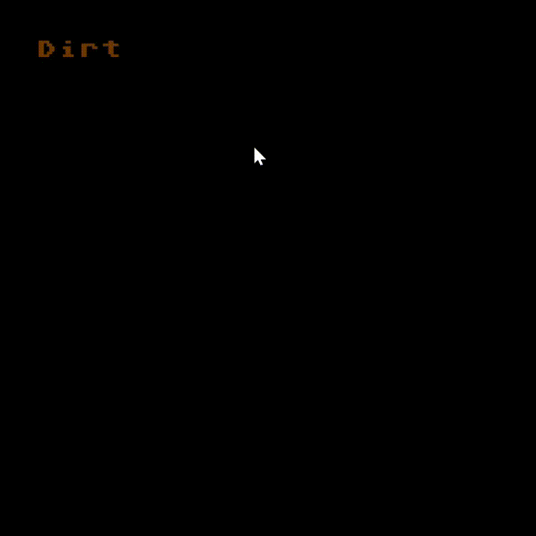
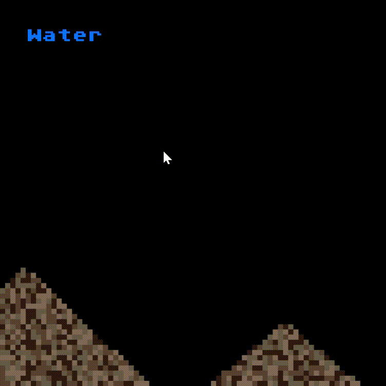
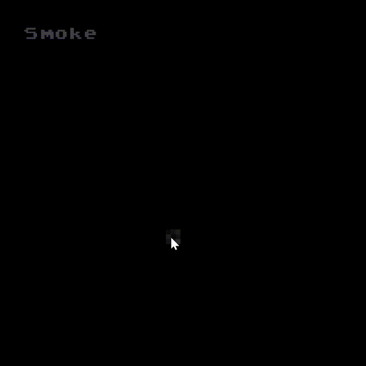
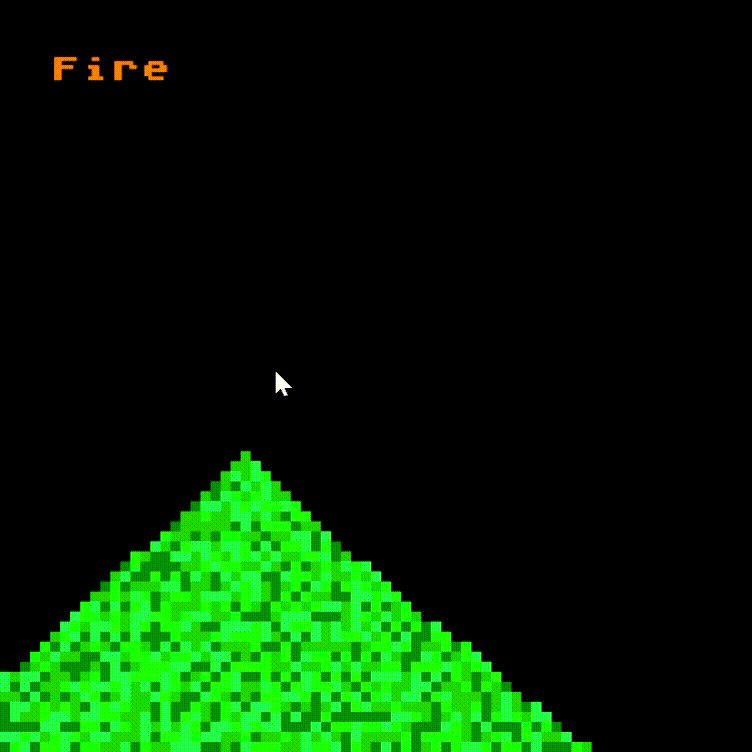

# A falling-sand game
I got bored. 

Boredom led to the creation of this glorious game.

This is a simple 2D particle falling-sand game built using C++ & SFML. This is not a complete project but it has a working framework, including:
- an approximation of gravity for solids, liquids and gases
- A working neighbor-checking system for adjacent grid squares
- Basic cellular automata logic

Warning ⚠️ - **THE FOLLOWING IMAGES ARE ALL OUT OF DATE. I'M NOT BOTHERED TO FIX THEM**
## Screenshot
  
## Features
### Currently implemented elements:
- $${\color{brown}Dirt}$$ (you can also see both the narrow and wide mouse placement modes)  
   
- $${\color{blue}Water}$$ 
   
- $${\color{grey}Smoke}$$ 
   
- $${\color{green}Gunpowder}$$ (gunpowder is green because I ran out of colours)
- $${\color{orange}Fire}$$ 
   
### Other features:
- Custom SFML font using Atari 800–inspired typography
- 75x75 grid-based simulation
- Object-oriented particle system
## Downloading & Running
1. Go to the `Releases` section
2. Download the most recent `.exe`
3. Run it

That’s it.
## Controls
- `Left-Click`: Place pixels
- Hold `Left-Shift`: Increase placement radius
  - **NEW** `Left Control` & `Left Shift`: Increase placement radius even more
- `Space`: Cycle through pixel types
- **NEW** `Number keys 1 to 5`: Cycle through pixel types
## How It Works
Genuine sorcery and pure nonsense with a pinch of tomfoolery.

There is a 75×75 grid of squares. When the left mouse button is pressed, a pixel object is created and placed into the corresponding grid cell.

From there:
- Each pixel updates every frame
- Neighbor cells are checked
- Movement rules are applied based on type (solid, liquid, gas)
- Transformations (like burning) can occur

<del>It’s essentially cellular automata + a **LOT** of classes.</del>  
Not anymore, it is now all numbers-based on a grid.
## What I Learned
- How to use SFML to render graphics
- The basics of cellular automata
- Managing grid-based simulations
- Handling object-oriented design in C++
## Known bugs
- <del>No density/weight system </del>
- <del>A blank pixel appears when cycling with Space </del>
- <del>The increased selection mode not being a uniform shape </del>
  - Only occurs with $${\color{grey}Smoke}$$. I am not sure how to fix this
## Future Improvements
- <del>Seperate the burning mechanic into a seperate class (will make my life easier in the future) </del>
- <del>Increase the grid size </del>
  - I have seperated the size of the pixels and the size of the window into a seperate file so this is kinda completed
  - <del>Convert the grid from being array-based into a 2D vector </del>
- <del>Implementing density-based gravity instead of uniform gravity</del>
- <del>Streamlining the gravity calculations to be one class instead of 3</del>
- Adding more elements (not sure which ones yet)
- Fixing the above bugs
- Improve performance & optimization
